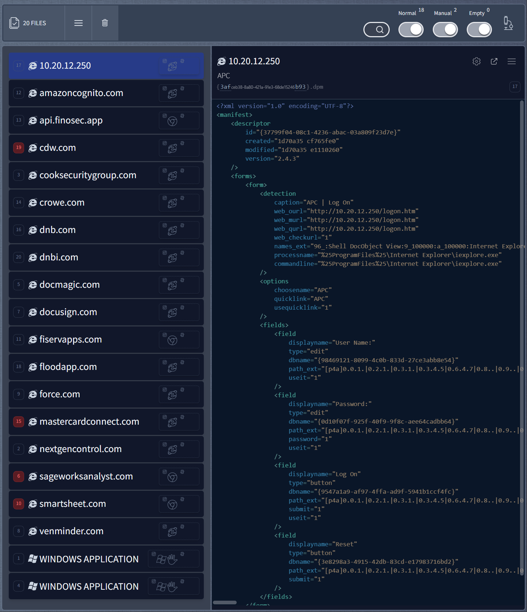
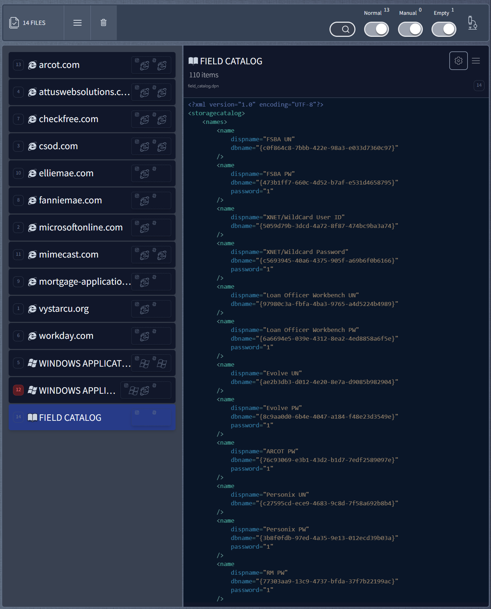
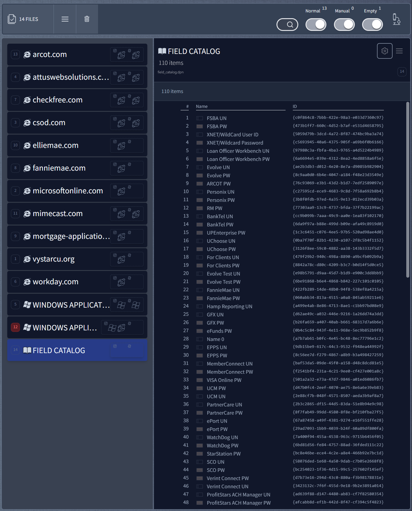
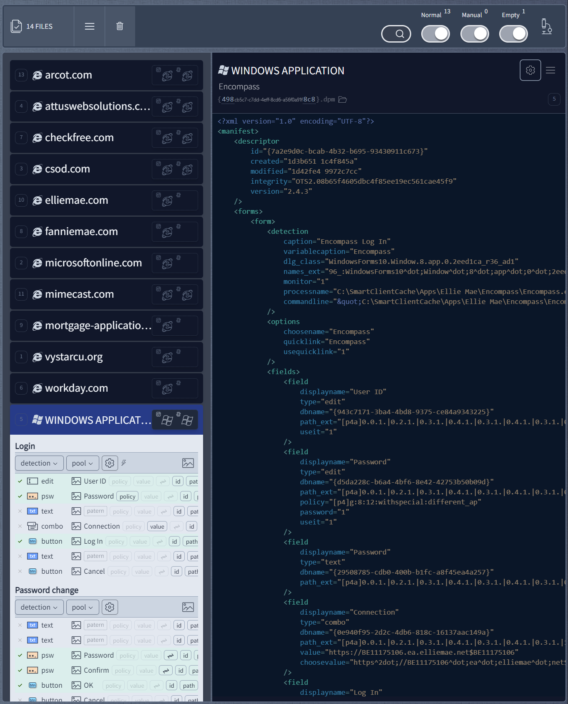
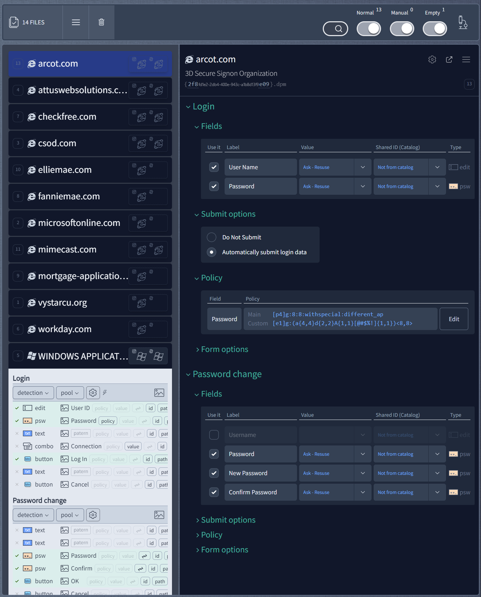
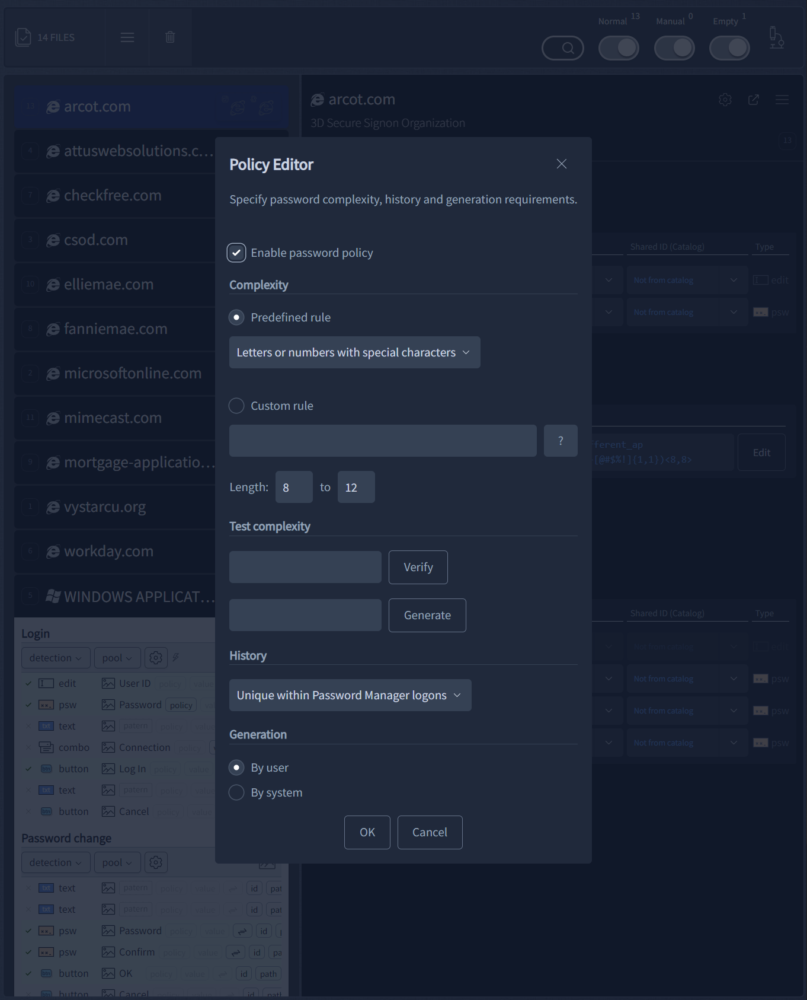
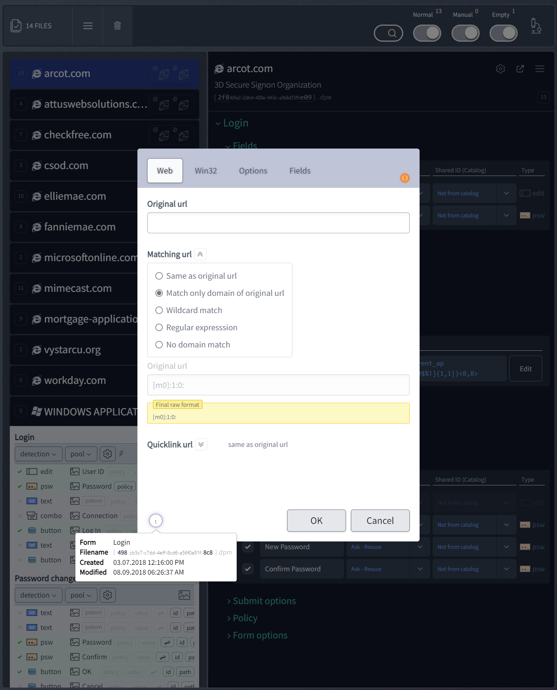

#### About

Experimenting with data-driven and self-learning UI (DDUI and SLUI).

<!--  -->

[**GitHub Dependencies Graph**](https://github.com/maxzz/dropzone/network/dependencies)

<!--
[**Visualization** of npm package usage](https://octo-repo-visualization.vercel.app/?repo=maxzz%2Fdropzone)
* [Explore for yourself](https://githubnext.com/projects/repo-visualization#explore-for-yourself) (search 'maxzz/dropzone')
* [tw](https://twitter.com/GitHubNext/status/1423315150413705223)
* [API repo](https://api.github.com/repos/maxzz/dropzone)
* [API followers](https://api.github.com/users/maxzz/followers)
* [GH advanced seach: 'create-diagram extension:yml'](https://github.com/search?q=create-diagram+extension%3Ayml&type=Code&ref=advsearch&l=&l=)
-->

#### Creadits, links, references

- [**React hooks: react-use**](https://github.com/streamich/react-use)
    <!--  -->
  - [`useCss hook`](https://github.com/streamich/react-use/blob/master/docs/useCss.md)

<!--  -->
<!-- [img-demo]: https://img.shields.io/badge/demo-%20%20%20%F0%9F%9A%80-green.svg -->

<!-- #### Live Demo [![][img-demo]](https://maxzz.github.io/dropzone) -->
#### Live Demo [🏹](https://maxzz.github.io/dropzone)

<!--
Tested project and now moved into 'not-used-now' src/components/UI/nun/nun.zip:

* from-radix-ui.tsx, UIDropdownMenuOrg.tsx - original example and component from radix-ui website

* UIDropdownMenuLaag.tsx - https://github.com/everweij/react-laag <- Hooks for positioning tooltips & popovers

* UIMultilineEdit.tsx - wrapper around DOM multiline edit control

* UISplitPane.ts, UISplitPane.css - https://github.com/tomkp/react-split-pane <- original split bar wo/ fixes

* Card/CardMenuOverlays.tsx - https://github.com/react-bootstrap/react-overlays
    Section2_Main.tsx:
        // import { CardMenuOverlays } from './Panel1_FilesList/Card/CardMenuOverlays';
        // import { CardMenu } from './Panel1_FilesList/Card/CardMenu';
        // import { Panel3_SelectedItems } from './Panel3_SelectedItems/Panel3_SelectedItems';
                {/* <CardMenuOverlays /> */}
                {/* <CardMenu /> */}
                {/* <Panel3_SelectedItems className="flex-none" /> */}

* https://github.com/wellyshen/react-cool-virtual

    folder useVirtual and

    Panel1_FilesList.tsx:
        //old: import Card, { CardWRef } from './Card/Card';
        //old: import useVirtual, { Item } from 'react-cool-virtual';
        //import useVirtual from '../../../hooks/useVirtual/useVirtual';

        /*
        function Panel1_FilesListNew({ className, ...rest }: HTMLAttributes<HTMLElement>) { //TODO: add compact view
            const files = useAtomValue(filteredAtom);

            //const [len, setLen] = useState(files.length);

            // useEffect(() => {
            //     setLen(files.length);
            //  }, [files.length]);

            const { outerRef, innerRef, items } = useVirtual<HTMLDivElement, HTMLDivElement>({
                // itemCount: len,
                itemCount: files.length,
                //resetScroll: true,
                // itemSize: 141,
                // itemSize: (idx: number) => {
                //     console.log('idx', idx);
                //     return 141;
                // },
            });

            //console.log(`items dropped: ${files.length} virtual:`, items);

            return (
                <>
                    

                        {/* 
 * /}
                        

                            {items.map(({ index, measureRef }) => {
                                const atom = files[index];
                                //console.log('item atom', atom);
                                if (!atom) {
                                    return;
                                }

                                return (
                                    //

                                    <CardWRef ref={measureRef} fileUsAtom={atom} className="mb-4" key={`${atom}`} />
                                    // <CardWRef fileUsAtom={atom} className="mb-4" key={`${atom}`} />
                                    //

                                );
                            })}
                        

                    

                </>
            );
        }
        */
* src/hooks/useClipcoardCopy.ts - https://github.com/feross/clipboard-copy - obsolete

* "@reach/router": "^1.3.4", - https://github.com/reach/router - never realy used and now is obsolete

* "framer-motion": "6.5.1", - https://github.com/framer/motion - never realy used and so far happy w/ react-spring

* "react-merge-refs": "2.0.1", - https://github.com/gregberge/react-merge-refs - so simple that no need to have a separate package

* "styled-components": "5.3.5", - https://github.com/styled-components/styled-components - should use instead of @stitches/react, but who cares
  "@types/styled-components": "5.1.26",

* from ManiActions.tsx:
        //import { PopoverMenu } from '@ui/nun/UIDropdownMenuLaag';
        //import { CardMenu } from './nun/CardMenu';

        export function ManiActions({ fileUsAtom }: { fileUsAtom: FileUsAtomType; }) {
            return (... {/* <PopoverMenu /> */} {/* <CardMenu /> */} );
        }

* TODO:
        "react-overlays": "5.2.0",
        "react-popper": "2.3.0",
        "react-popper-tooltip": "4.4.2",

-->

<!--

<h3>Contributors</h3>

 

-->

   
  <h1>⅚⚗</h1>
  Data-Driven User Interfaces
   
   
  <!-- <pre>npm i <a href="https://www.npmjs.com/package/react-use">react-use</a></pre> -->

<!--
setting.json:

    "tailwindCSS.experimental.classRegex": [

        "\"([^\"]*)\"",
        "classNames\\('([^)]*)\\')",
        "'([^']*)'"
    ],

probelms with that:
    * abnormal amount of intellisense hints and first is tailwind/CSS text instead of the real help
    * color squares are doubled

another version tw("classes") and classNames("classes", "classes"):
    * classNames can be multiline
    * need spaces around string content
    * will not work for grid-cols-[minmax(0,1fr)]

    "tailwindCSS.experimental.classRegex": [
        "tw\\(['\"`]([^)]*)['\"`]\\)",
        "classNames\\(([^)]*)\\)",
    ],

another version with ending by ';':
    * will combine until the next operator if ';' is missing;
    * spaces after and before quatas also required, i.e. " p-2 "

    "tailwindCSS.experimental.classRegex": [
        "tw\\(['\"`]([^)]*)['\"`]\\)",
        "classNames\\(([^;]*)\\);",
    ],

 -->